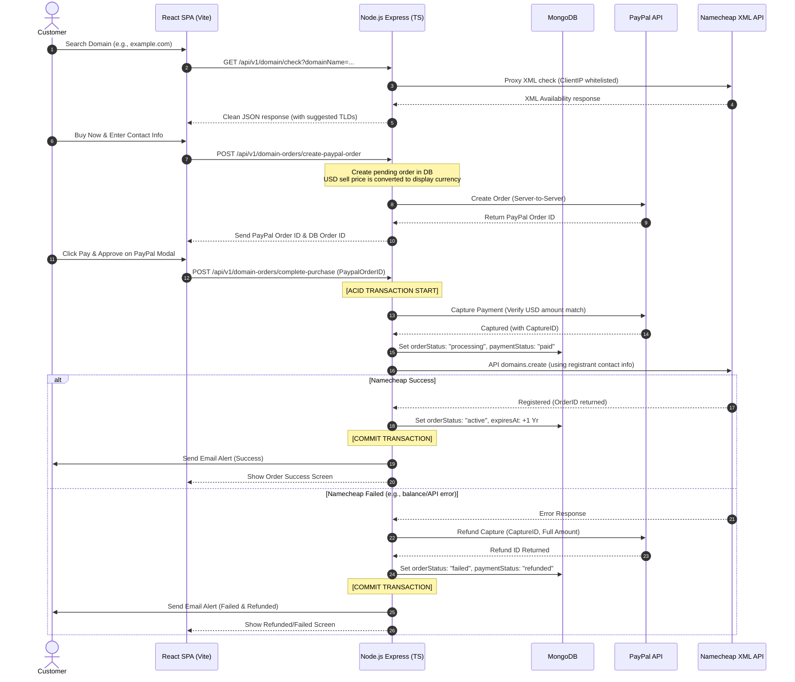

# BIT Software — Domain E-Commerce Platform Architecture Report

এই রিপোর্টে আমরা ডোমেন সার্চ, ফিক্সড প্রাইসিং, কারেন্সি কনভার্শন, সিকিউর পেপাল ট্রানজেকশন, নেমচিপ অটো-রেজিস্ট্রেশন এবং কাস্টমার/এডমিন ড্যাশবোর্ড ইন্টিগ্রেশনের পুরো আর্কিটেকচার এবং ভবিষ্যতে ডোমেন ও হোস্টিং ব্যবসাকে বড় করার বিস্তারিত **Future Roadmap** তুলে ধরেছি।

---

## 🗺️ System Architecture Diagram

নিচের ডায়গ্রামটি ডোমেন সার্চ থেকে নেমচিপ এপিআই রেজিস্ট্রেশন এবং ব্যর্থতায় অটো-রিফান্ড পর্যন্ত সম্পন্ন ডাটা ও লজিক ফ্লো নির্দেশ করে:



---

## 📂 File Registry & Directory Map

সম্পূর্ণ সিস্টেমে মোট **২৫টি ফাইলে** কোড করা হয়েছে (১২টি ব্যাকএন্ডে, ১৩টি ফ্রন্টএন্ডে):

### 1. Backend Modules (Express & Node.js)
* **Configuration:**
  - [src/config/index.ts](file:///d:/Jakir-Vai/BIT_Software_And_IT_Soilution_Backend/src/app/config/index.ts) — .env থেকে নেমচিপ রেজিস্ট্রেন্ট কন্টাক্ট ডাটা এবং এপিআই ইনফো প্রজেক্টের মেইন কনফিগারেশনে ইন্টিগ্রেট করে।
  - [.env](file:///d:/Jakir-Vai/BIT_Software_And_IT_Soilution_Backend/.env) — এক্সচেঞ্জ রেট কি এবং নেমচিপ কন্টাক্ট প্লেসহোল্ডার ডেফিনিশন।
* **PayPal integration:**
  - [src/app/utils/paypal.ts](file:///d:/Jakir-Vai/BIT_Software_And_IT_Soilution_Backend/src/app/utils/paypal.ts) — পেপ্যাল ক্যাপচার রিফান্ড মেথড (`refundPayPalCapture`) যুক্ত করা হয়েছে।
* **Domain Search Module:**
  - [domain.service.ts](file:///d:/Jakir-Vai/BIT_Software_And_IT_Soilution_Backend/src/app/modules/Domain/domain.service.ts) — এপিআই whitelisting এবং প্রক্সি আইপি ইস্যু এড়াতে **Auto IP Detection** যুক্ত করা হয়েছে।
* **Domain Orders (E-commerce Core):**
  - [domainOrder.interface.ts](file:///d:/Jakir-Vai/BIT_Software_And_IT_Soilution_Backend/src/app/modules/DomainOrder/domainOrder.interface.ts) — ডাটাবেস স্কিমার জন্য টাইপস্ক্রিপ্ট টাইপস।
  - [domainOrder.model.ts](file:///d:/Jakir-Vai/BIT_Software_And_IT_Soilution_Backend/src/app/modules/DomainOrder/domainOrder.model.ts) — কুইক সার্চ, এপিআই ফিল্টারিং এবং ডুপ্লিকেট পেমেন্ট আটকাতে ইউনিক ও কম্পাউন্ড ইনডেক্স সহ স্কিমা।
  - [domainOrder.service.ts](file:///d:/Jakir-Vai/BIT_Software_And_IT_Soilution_Backend/src/app/modules/DomainOrder/domainOrder.service.ts) — এক্সচেঞ্জ রেট ক্যাশিং (১ ঘন্টা), পেপ্যাল ভেরিফিকেশন এবং নেমচিপ অটো-রেজিস্ট্রেশন সহ ট্রানজেকশনাল ইমেইল মেথড।
  - [domainOrder.controller.ts](file:///d:/Jakir-Vai/BIT_Software_And_IT_Soilution_Backend/src/app/modules/DomainOrder/domainOrder.controller.ts) — রিকোয়েস্ট ভ্যালিডেশন এবং এপিআই রেসপন্স পার্সার।
  - [domainOrder.routes.ts](file:///d:/Jakir-Vai/BIT_Software_And_IT_Soilution_Backend/src/app/modules/DomainOrder/domainOrder.routes.ts) — রেট লিমিটিং প্রটেকশন সহ সিকিউর রাউটস।
  - [src/app/routes/index.ts](file:///d:/Jakir-Vai/BIT_Software_And_IT_Soilution_Backend/src/app/routes/index.ts) — নতুন রাউট মেইন রাউট ইনডেক্সে যুক্ত করা হয়েছে।

### 2. Frontend Modules (Vite & React)
* **Global States & Contexts:**
  - [src/context/CurrencyContext.jsx](file:///d:/Jakir-Vai/BIT_Software_And_IT_Soilution_Frontend/src/context/CurrencyContext.jsx) — লাইভ কনভার্সন রেট এপিআই কল এবং লোকালস্টোরেজ ইন্টিগ্রেশন।
  - [src/app/store.js](file:///d:/Jakir-Vai/BIT_Software_And_IT_Soilution_Frontend/src/app/store.js) — রিডাক্স স্টোরে কারেন্সি রিডিউসার ইন্টিগ্রেশন।
* **Components:**
  - [CurrencySelector.jsx](file:///d:/Jakir-Vai/BIT_Software_And_IT_Soilution_Frontend/src/components/common/CurrencySelector.jsx) — কারেন্সি চেঞ্জার ড্রপডাউন উইজেট।
  - [CurrencySelector.css](file:///d:/Jakir-Vai/BIT_Software_And_IT_Soilution_Frontend/src/components/common/CurrencySelector.css) — ডার্ক ও লাইট মোডের সলিড ব্যাকগ্রাউন্ড এবং হাই z-index (`1000`) পজিশন ডিজাইন।
  - [Navbar.jsx](file:///d:/Jakir-Vai/BIT_Software_And_IT_Soilution_Frontend/src/components/common/Navbar/Navbar.jsx) — নেভিগেশনে কারেন্সি ড্রপডাউন এবং `/my-account` লিঙ্ক অ্যাড করা হয়েছে।
* **Pages & Routing:**
  - [routes.js](file:///d:/Jakir-Vai/BIT_Software_And_IT_Soilution_Frontend/src/router/routes.js) / [index.jsx](file:///d:/Jakir-Vai/BIT_Software_And_IT_Soilution_Frontend/src/router/index.jsx) — প্রটেক্টেড রাউট হিসেবে চেকআউট এবং অ্যাকাউন্ট পেজের রেজিস্ট্রেশন।
  - [DomainHosting/index.jsx](file:///d:/Jakir-Vai/BIT_Software_And_IT_Soilution_Frontend/src/pages/Services/DomainHosting/index.jsx) — ডোমেন সার্চ রেজাল্টকে চেকআউট পেজের সাথে কানেক্ট করা হয়েছে এবং এক্সটেনশন প্রাইজ লিস্টে কারেন্সি কনভার্সন ইন্টিগ্রেট করা হয়েছে।
  - [DomainCheckout/index.jsx](file:///d:/Jakir-Vai/BIT_Software_And_IT_Soilution_Frontend/src/pages/DomainCheckout/index.jsx) — ডোমেন বাইয়ার কন্টাক্ট ফর্ম এবং পেপ্যাল পেমেন্ট গেটওয়ে।
  - [MyAccount/index.jsx](file:///d:/Jakir-Vai/BIT_Software_And_IT_Soilution_Frontend/src/pages/MyAccount/index.jsx) — কাস্টমার অ্যাকাউন্ট ড্যাশবোর্ড (Expiry countdown ও WHOIS প্রটেকশন স্ট্যাটাস সহ)।
  - [MyAccount.css](file:///d:/Jakir-Vai/BIT_Software_And_IT_Soilution_Frontend/src/pages/MyAccount/MyAccount.css) — রেসপন্সিভ কাস্টমার প্যানেল লেআউট।
  - [DomainOrders/index.jsx](file:///d:/Jakir-Vai/BIT_Software_And_IT_Soilution_Frontend/src/pages/Dashboard/DomainOrders/index.jsx) — এডমিন ডোমেন অর্ডার টেবিল ও স্ট্যাটাস চেঞ্জার মডাল।
  - [DomainOrders.css](file:///d:/Jakir-Vai/BIT_Software_And_IT_Soilution_Frontend/src/pages/Dashboard/DomainOrders/DomainOrders.css) — এডমিন টেবিল সিএসএস।
  - [DashboardLayout.jsx](file:///d:/Jakir-Vai/BIT_Software_And_IT_Soilution_Frontend/src/layouts/DashboardLayout.jsx) — এডমিন সাইডবারে "Domain Orders" ট্যাব ইন্টিগ্রেশন।

---

## 🧠 Core Business Logics (ব্যবসায়িক নিয়ম ও কোড লজিক)

### 1. Fixed Pricing Model (ফিক্সড সেলিং প্রাইস)
আপনি কাস্টমারের কাছ থেকে ডোমেনের এক্সটেনশন অনুযায়ী ফিক্সড অ্যামাউন্ট চার্জ করবেন, কিন্তু নেমচিপ আপনার অ্যাকাউন্ট থেকে ডোমেনের আসল মূল্য কেটে নিবে।
* ব্যাকএন্ড সার্ভিস ফাইলে [DOMAIN_PRICING](file:///d:/Jakir-Vai/BIT_Software_And_IT_Soilution_Backend/src/app/modules/DomainOrder/domainOrder.service.ts#L22) কনস্ট্যান্ট অবজেক্টে বিক্রয় মূল্য সেট করা হয়েছে (যেমন: `.com` = $15, `.net` = $17)।
* ফ্রন্টএন্ডেও [TLD_PRICES](file:///d:/Jakir-Vai/BIT_Software_And_IT_Soilution_Frontend/src/pages/Services/DomainHosting/index.jsx#L27) এর সাথে এটি সিঙ্ক করা হয়েছে যাতে কাস্টমার ডোমেন সার্চ করা মাত্রই আপনার বিক্রয় মূল্য দেখতে পায়।

### 2. Multi-Currency Display (সার্বজনীন কারেন্সি রূপান্তর)
ডিফল্ট কারেন্সি হলো `SAR` (সৌদি রিয়াল)। এছাড়া USD, EUR, CAD, BDT, PKR, INR কারেন্সি কাস্টমার সিলেক্ট করতে পারবে।
* **ডাটাবেস লজিক:** ডাটাবেসে সবসময় ডোমেনের দাম এবং হিসেব USD কারেন্সিতে সংরক্ষিত থাকবে। এটি অ্যাকাউন্টিং এবং নেমচিপের পেমেন্টের হিসাব সহজ রাখবে।
* **এক্সচেঞ্জ রেট ক্যাশিং:** ব্যাকএন্ডে এক্সচেঞ্জ রেট API কল প্রতি ঘন্টায় সর্বোচ্চ একবার হবে এবং ব্যাকএন্ড ক্যাশে জমা থাকবে। ফলে এপিআই থ্রটলিং বা অতিরিক্ত রিকোয়েস্টের বিল আসবে না।
* **রেন্ডারিং লজিক:** ফ্রন্টএন্ডের `CurrencyContext` এক্সচেঞ্জ রেট ব্যবহার করে ইউজারের সিলেক্ট করা কারেন্সিতে দাম কনভার্ট করে ফরম্যাট করে দেখায় (যেমন: $15 $\times$ BDT 110 = ৳1,650)।

### 3. ACID Transaction Flow (নিরাপদ লেনদেন নীতি)
কোনো কাস্টমার পেমেন্ট করার পর ডাটাবেস আপডেট এবং নেমচিপ এপিআই রেজিস্ট্রেশন কলকে একটি **Atomic Session** (একটি অবিভাজ্য একক) হিসেবে চালানো হয়।
* পেপ্যাল পেমেন্ট ক্যাপচার করার পর ডোমেন অর্ডার স্ট্যাটাস `processing` এ নিয়ে যাওয়া হয়।
* এরপর নেমচিপ এপিআই ডাকা হয়। যদি নেমচিপ কোনো কারণে (যেমন: অ্যাকাউন্টে ব্যালেন্সের অভাব বা নেমচিপ সার্ভার ডাউন) ডোমেন রেজিষ্টার করতে ব্যর্থ হয়, তাহলে পেপ্যাল এপিআই দিয়ে সাথে সাথে **Auto-Refund** সফলভাবে ট্রিগার হয়ে যায় এবং ডাটাবেস ট্রানজেকশন রোলব্যাক/আপডেট করে অর্ডার স্ট্যাটাস `failed` ও পেমেন্ট স্ট্যাটাস `refunded` সেট করা হয়।
* এটি একই সময়ে একাধিক ইউজার রিকোয়েস্ট করলেও ডাটাবেস লকিং এবং সেশন ট্রানজেকশনের কারণে ডুপ্লিকেট পেমেন্ট বা ডোমেন হারানোর ভয় থাকে না।

---

## 🔮 Future Roadmap & Implementation Guide (ভবিষ্যত পরিকল্পনা ও বাস্তবায়নের উপায়)

ডোমেন ও হোস্টিং ব্যবসাকে পরিপূর্ণ রূপ দিতে নিচের ৭টি গুরুত্বপূর্ণ মডিউল ভবিষ্যতে যুক্ত করার নির্দেশিকা নিচে দেওয়া হলো:

### 1. bKash, SSLCommerz, & Local Payment Gateways (BDT পেমেন্ট ইন্টিগ্রেশন)
বাংলাদেশি কাস্টমারদের বিকাশের মাধ্যমে পেমেন্ট রিসিভ করে অটোমেটিক নেমচিপে ডোমেন কেনা।

#### **কি করতে হবে:**
* কাস্টমার বিকাশ সিলেক্ট করলে ফ্রন্টএন্ডে বিকাশের অফিশিয়াল স্ক্রিপ্ট লোড হবে এবং ওটিপি (OTP) ও পিন (PIN) দিয়ে পেমেন্ট গেটওয়ে কমপ্লিট করবে।

#### **কোথায় কোড করবেন:**
* **Backend:** `domainOrder.service.ts` এ নতুন `completeDomainPurchaseWithbKash` মেথড লিখবেন।
  - বিকাশ এপিআই ডিরেক্টরি থেকে পেমেন্ট ভেরিফিকেশন এন্ডপয়েন্ট (`/checkout/payment/status`) কল করে অ্যামাউন্ট চেক করবেন।
  - অ্যামাউন্ট সঠিক থাকলে MongoDB Session এর মাধ্যমে পেমেন্ট `paid` এবং নেমচিপের ডোমেন রেজিষ্ট্রেশন এপিআই কল করাবেন।
* **Frontend:** `DomainCheckout/index.jsx` এ পেপ্যাল বাটনের পাশাপাশি বিকাশের পেমেন্ট গেটওয়ে উইজেট লোড করাবেন।
* **এপিআই ও রিসোর্স:** [bKash Merchant Portal API Documentation](https://developer.bka.sh/)

---

### 2. DNS & Nameserver Customization (নেমসার্ভার ও ডিএনএস কন্ট্রোল)
কাস্টমার যেন তার `/my-account` ড্যাশবোর্ড থেকে ডোমেনের কাস্টম নেমসার্ভার (যেমন: `ns1.cloudflare.com`) পরিবর্তন করতে পারে।

#### **কি করতে হবে:**
* নেমচিপের DNS API ব্যবহার করে কাস্টমারকে ডোমেনের নেমসার্ভার আপডেট এবং সাধারণ DNS Records (A, CNAME, MX) যোগ বা এডিট করার প্যানেল তৈরি করা।

#### **কোথায় কোড করবেন:**
* **Backend:** 
  - `domain.service.ts` এ নেমচিপের `namecheap.domains.dns.setCustom` এবং `namecheap.domains.dns.setDefault` এপিআই ইন্টিগ্রেট করবেন।
  - `domainOrder.routes.ts` এ `PATCH /my-domains/:id/dns` এন্ডপয়েন্ট তৈরি করবেন।
* **Frontend:**
  - `MyAccount/index.jsx` এ ডোমেন কার্ডের ভেতরে একটি **"Manage DNS"** ট্যাব বা লিঙ্ক তৈরি করবেন।
  - সেখানে ২টি ইনপুট ফিল্ড সহ কাস্টম নেমসার্ভার সাবমিট করার ফর্ম তৈরি করবেন।
* **নেমচিপ এপিআই কমান্ড:**
  - `Command=namecheap.domains.dns.setCustom` (Nameserver আপডেটের জন্য)
  - `Command=namecheap.domains.dns.getHosts` (DNS রেকর্ড রিড করার জন্য)

---

### 3. Automated Expiry Cron Job (ক্রন জব এলার্ট ও রিমাইন্ডার)
ডোমেনের মেয়াদ শেষ হওয়ার ৩০ দিন, ১৫ দিন এবং ১ দিন আগে কাস্টমারকে স্বয়ংক্রিয়ভাবে ইমেইল অ্যালার্ট পাঠানো।

#### **কি করতে হবে:**
* সার্ভারে ব্যাকগ্রাউন্ডে একটি ডেইলি নোটিফিকেশন টাস্ক রান করানো যা মেয়াদ ফুরিয়ে আসা ডোমেনগুলোকে ফিল্টার করে কাস্টমারকে ওয়ার্নিং ইমেইল পাঠাবে।

#### **কোথায় কোড করবেন:**
* **Backend:** `src/app/utils/cronJobs.ts` নামে একটি ফাইল তৈরি করবেন।
  - `node-cron` প্যাকেজ ব্যবহার করে প্রতিদিন রাত ১২:০০ টায় রান করার শিডিউলার তৈরি করবেন:
    ```typescript
    import cron from 'node-cron';
    cron.schedule('0 0 * * *', async () => {
      const expiringDomains = await DomainOrder.find({
        orderStatus: 'active',
        expiresAt: {
          $gte: new Date(),
          $lte: new Date(Date.now() + 30 * 24 * 60 * 60 * 1000) // ৩০ দিন
        }
      });
      // loop চালিয়ে nodemailer দিয়ে sendEmail কল করবেন
    });
    ```
  - `server.ts` এ ক্রন জব ফাইলটি ইমপোর্ট করে রাখলে ব্যাকগ্রাউন্ডে অটো-স্টার্ট হবে।

---

### 4. WHOIS Custom Contact Form (কাস্টম রেজিস্ট্রেন্ট কন্টাক্ট)
ডোমেন রেজিষ্ট্রেশনের সময় আপনার কোম্পানির তথ্যের পরিবর্তে কাস্টমার যাতে নিজের নামে ডোমেন রেজিষ্টার করতে পারে (প্রাইভেসি সুরক্ষিত রেখে)।

#### **কি করতে হবে:**
* চেকআউট ফর্মে কন্টাক্ট ডিটেইলস ছাড়াও ডোমেনের অফিশিয়াল টেকনিক্যাল, এডমিন এবং রেজিস্ট্রেন্ট কন্টাক্ট ইনফরমেশন ইনপুট দেওয়ার ফিল্ড যুক্ত করা।

#### **কোথায় কোড করবেন:**
* **Backend:** 
  - `domainOrder.interface.ts` এ Registrant, Technical, এবং Administrative কন্টাক্ট ডিটেইলসের জন্য নেস্টেড অবজেক্ট যুক্ত করবেন।
  - `domainOrder.service.ts` এ নেমচিপ এপিআই কল করার সময় আমাদের .env ফাইলের কনফিগারেশনের বদলে ডাটাবেসের অর্ডারে সেভ হওয়া কাস্টমারের ইউনিক কন্টাক্ট ইনফো প্যারামিটার হিসেবে পাঠিয়ে দিবেন।
* **Frontend:**
  - `DomainCheckout/index.jsx` পেজের কন্টাক্ট ফর্মে "Use custom WHOIS info" নামে একটি টগল চেকবক্স রাখবেন, যা অন করলে এড্রেস, জিপ কোড এবং কান্ট্রি সিলেক্ট করার ইনপুট ফিল্ডগুলো ওপেন হবে।

---

### 5. WHMCS / WHM Auto-Provisioning (হোস্টিং অটো-ডেলিভারি)
কাস্টমার ডোমেনের পাশাপাশি যখন কোনো হোস্টিং প্ল্যান কিনবে, তখন আপনার ভিপিএস (VPS) বা রিসেলার সার্ভারে (WHM) স্বয়ংক্রিয়ভাবে হোস্টিং অ্যাকাউন্ট তৈরি হওয়া।

#### **কি করতে হবে:**
* WHM (Web Host Manager) বা cPanel এপিআই ব্যবহার করে রিয়েল-টাইম হোস্টিং অ্যাকাউন্ট প্রোভিশনিং অটোমেট করা।

#### **কোথায় কোড করবেন:**
* **Backend:** `src/app/utils/whm.ts` ইউটিলিটি ফাইল তৈরি করবেন।
  - WHM এর `createacct` এপিআই এন্ডপয়েন্ট ইন্টিগ্রেট করবেন:
    `https://YOUR_SERVER_IP:2087/json-api/createacct?api.version=1&username=...&domain=...&plan=...`
  - ডোমেন ও হোস্টিংয়ের কম্বো পেমেন্ট সাকসেস হলে `completeDomainPurchase` লজিক ট্রানজেকশনে এই WHM সার্ভিসটি কল করাবেন।
  - সফল হলে কাস্টমারকে ইমেইলে cPanel-এর ইউজারনেম, পাসওয়ার্ড এবং আইপি পাঠিয়ে দেবেন।
* **এপিআই ও রিসোর্স:** [cPanel & WHM Developer API docs](https://api.docs.cpanel.net/)

---

### 6. Invoice PDF Generator (ইনভয়েস পিডিএফ জেনারেটর)
অর্ডার সম্পন্ন হওয়ার পর কাস্টমার যেন ড্যাশবোর্ড থেকে অফিশিয়াল ইনভয়েস পিডিএফ ডাউনলোড করতে পারে।

#### **কি করতে হবে:**
* অর্ডারের সব ডাটা এবং কারেন্সি সিম্বল সহ একটি প্রফেশনাল ইনভয়েস পিডিএফ তৈরি করা।

#### **কোথায় কোড করবেন:**
* **Backend:** 
  - `pdfkit` বা `puppeteer` এনপিএম লাইব্রেরি ব্যাকএন্ডে ইন্সটল করবেন।
  - `domainOrder.routes.ts` এ `GET /domain-orders/:id/invoice` রাউট তৈরি করবেন।
  - কাস্টমার ক্লিক করলে ব্যাকএন্ড লাইভ অর্ডারের ডাটা রিড করে মেমোরিতে পিডিএফ জেনারেট করে স্ট্রিম রেসপন্স হিসেবে ব্রাউজারে পাঠাবে (Response content-type: `application/pdf`)।
* **Frontend:** `MyAccount/index.jsx` এবং Admin `DomainOrders/index.jsx` এ প্রতিটি অর্ডার লাইনের সাথে একটি **"Download Invoice"** পিডিএফ বাটন অ্যাড করবেন।

---

### 7. AI-Powered Smart Domain Suggestions (এআই ডোমেন সাজেশন)
ইউজার যদি কাঙ্ক্ষিত ডোমেনটি খালি না পায়, তবে কৃত্রিম বুদ্ধিমত্তা (AI) ব্যবহার করে তার রিলেটেড চমৎকার সব অল্টারনেটিভ ডোমেন সাজেস্ট করা।

#### **কি করতে হবে:**
* OpenAI (ChatGPT এপিআই) বা Gemini API ব্যবহার করে ইউজারের কীওয়ার্ড অনুযায়ী খালি থাকা ১০টি ক্রিয়েটিভ ডোমেন নেম জেনারেট করে ডোমেন এপিআই দিয়ে চেক করা।

#### **কোথায় কোড করবেন:**
* **Backend:** `domain.service.ts` এ OpenAI এপিআই যুক্ত করবেন।
  - ইউজার সার্চ করলে প্রম্পট পাঠাবেন: *"Provide 5 creative domain suggestions related to 'keywords' in .com, .net extensions. Output only domain names as comma-separated list."*
  - এআই এর রেসপন্স লিস্টটি নিয়ে নেমচিপ এপিআই দিয়ে চেক করে খালি থাকা ডোমেনগুলো সাজেশনে দেখাবেন।
* **Frontend:** `DomainHosting/index.jsx` এর ডোমেন সার্চ রেজাল্টের নিচে একটি **"Generate AI suggestions"** বাটন যোগ করবেন যা এআই রিকমেন্ডেড ডোমেন লিস্ট রেন্ডার করবে।
