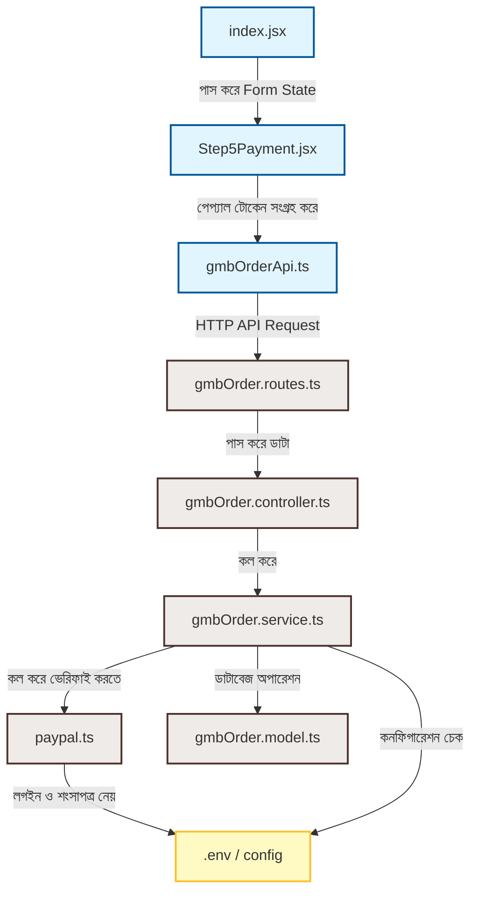

# 🛠️ PayPal Integration — Architecture & Flow Document

এই ডকুমেন্টে পেপ্যাল ইন্টিগ্রেশনের সব ফাইলের কাজ, পারস্পরিক সম্পর্ক এবং গ্রাহক পেমেন্ট করার পর ডেটাবেজ সেভ হওয়া পর্যন্ত সম্পূর্ণ ফ্লো বিস্তারিতভাবে বর্ণনা করা হলো।

---

## 📁 ১. ফাইলসমূহের তালিকা ও তাদের দায়িত্ব (Architecture & Roles)

ইন্টিগ্রেশনটি সম্পূর্ণ **MVC (Model-View-Controller)** ও **Service-Layer** আর্কিটেকচার মেনে ডেভেলপ করা হয়েছে।

### 🌐 ক. Frontend (Client-Side)

#### ১. [Step5Payment.jsx](file:///D:/Jakir-Vai/BIT_Software_&_IT_Soilution_Frontend/src/pages/Services/GoogleMyBusiness/Step5Payment.jsx)
* **কাজ**: এটি ফিক্সড উইজার্ডের ৫ম ধাপ। এটি পেমেন্ট গেটওয়ে ইন্টারফেস দেখায়।
* **পেপ্যাল রোল**: `@paypal/react-paypal-js` লাইব্রেরি ব্যবহার করে এটি সরাসরি পেপ্যালের অফিশিয়াল বাটন (Pay with PayPal, Pay Later, Debit/Credit Card) ব্রাউজারে রেন্ডার করে।
* **পেমেন্ট জেনারেশন**: বাটন ক্লিক করা হলে এটি পেপ্যালের সার্ভারে পেমেন্ট সেশন ইনিশিয়েট করে এবং ইউজার সফলভাবে পেপ্যাল উইন্ডোতে পেমেন্ট করলে একটি `orderID` (যেমন: `3H892305JH3242`) এবং ভেরিফাইড ট্রানজেকশন আইডি ব্যাক করে।
* **ব্যাকএন্ড সাবমিশন**: পেমেন্ট নিশ্চিত হবার পর এটি ব্যাকএন্ড এপিআই রাউটে অর্ডারের ডেটা এবং পেপ্যাল আইডি সহ রিকোয়েস্ট সেন্ড করে।

#### ২. [index.jsx](file:///D:/Jakir-Vai/BIT_Software_&_IT_Soilution_Frontend/src/pages/Services/GoogleMyBusiness/index.jsx)
* **কাজ**: এটি মূল জিএমবি সার্ভিস পেজ যা ১ থেকে ৪ ধাপের ইনপুট ডাটা (যেমন: ব্যবসার নাম, ক্যাটাগরি, এড্রেস, ফোন ইত্যাদি) সংগ্রহ করে রাখে এবং ৫ম ধাপে `Step5Payment` রেন্ডার করার সময় সেই ফর্ম ডাটা পাস করে দেয়।
* **অর্ডার সম্পন্নকারী**: পেমেন্ট সাকসেসফুল হলে `handleSubmit` ফাংশনের মাধ্যমে ব্যাকএন্ডে রিকোয়েস্ট পাঠিয়ে সফল মেসেজ ও অর্ডার ট্র্যাকিং সামারি স্ক্রিনে দেখায়।

---

### 💻 খ. Backend (Server-Side)

#### ৩. [gmbOrder.routes.ts](file:///D:/Jakir-Vai/BIT_Software_&_IT_Soilution_Backend/src/app/modules/GmbOrder/gmbOrder.routes.ts)
* **কাজ**: জিএমবি অর্ডার এপিআই-এর এন্ট্রি পয়েন্ট।
* **নিরাপত্তা ও ভ্যালিডেশন**: 
  - `orderRateLimit` দিয়ে স্প্যামিং বন্ধ করতে রেট লিমিট অ্যাড করে (১৫ মিনিটে ৫টি রিকোয়েস্ট)।
  - ম্যানুয়াল স্ক্রিনশট আপলোডের জন্য `multer` ফাইল হ্যান্ডলার দিয়ে ফাইলের সাইজ ও এক্সটেনশন ভ্যালিডেশন করে।
  - অ্যাডমিন প্যানেলের জন্য অ্যাডমিন প্রোটেক্টেড রাউট ডিফাইন করে।

#### ৪. [gmbOrder.controller.ts](file:///D:/Jakir-Vai/BIT_Software_&_IT_Soilution_Backend/src/app/modules/GmbOrder/gmbOrder.controller.ts)
* **কাজ**: রাউট থেকে কল এসে প্রথমে এই ফাইলে ঢোকে।
* **সার্ভিস কলিং**: এটি এক্সপ্রেসের `req.body` এবং `req.file` রিসিভ করে সার্ভিস লেয়ারের `GmbOrderServices.submitGmbOrder(orderData)` মেথডকে রান করায় এবং রেসপন্স ক্লায়েন্টে পাঠায়।

#### ৫. [gmbOrder.service.ts](file:///D:/Jakir-Vai/BIT_Software_&_IT_Soilution_Backend/src/app/modules/GmbOrder/gmbOrder.service.ts)
* **কাজ**: এটি এই আর্কিটেকচারের সবচেয়ে গুরুত্বপূর্ণ ফাইল। এটি সম্পূর্ণ বিজনেস লজিক হ্যান্ডেল করে।
* **পেপ্যাল চেক**: গ্রাহক পেপ্যাল আইডি পাঠালে এটি ইউজার ইনপুট বিশ্বাস না করে সরাসরি পেপ্যাল সার্ভারের সাথে কানেক্ট হয়ে অর্ডারের মূল অবস্থা এবং গ্রাহক কত ডলার পেমেন্ট করেছেন তা রিট্রিভ করে।
* **Database Transaction (রোলব্যাক)**: যদি পেপ্যাল সফল হয় কিন্তু ডাটা সেভ করার সময় ডাটাবেজ ক্র্যাশ করে বা ভুল হয়, তবে এটি ট্রানজেকশন রোলব্যাক করে যাতে ডেটাবেজে কোনো অসম্পূর্ণ বা ভুল রেকর্ড না যায়।

#### ৬. [paypal.ts](file:///D:/Jakir-Vai/BIT_Software_&_IT_Soilution_Backend/src/app/utils/paypal.ts)
* **কাজ**: পেপ্যালের ব্যাকএন্ড ইউটিলিটি।
* **OAuth2 Authentication**: ব্যাকএন্ড `.env` থেকে `PAYPAL_CLIENT_ID` এবং `PAYPAL_CLIENT_SECRET` ব্যবহার করে বেসিক অথরাইজেশন টোকেন জেনারেট করে।
* **অর্ডার ভেরিফিকেশন API**: ওঅথ২ টোকেন নিয়ে সরাসরি পেপ্যালের ক্লাউড এপিআই `https://api-m.sandbox.paypal.com/v2/checkout/orders/:orderId` রিকোয়েস্ট পাঠায় এবং অর্ডারের অফিশিয়াল রেসপন্স অবজেক্ট ব্যাক করে।

#### ৭. [gmbOrder.model.ts](file:///D:/Jakir-Vai/BIT_Software_&_IT_Soilution_Backend/src/app/modules/GmbOrder/gmbOrder.model.ts)
* **কাজ**: মঙ্গুজ ডাটাবেজ স্কিমা ফাইল। অর্ডারের সকল ডাটার টাইপ, রিকোয়ার্ড ফিল্ড এবং স্টাইল ফরমেট ডিফাইন করে। ডুপ্লিকেট পেপ্যাল ট্রানজেকশন আইডি চেক করতে `unique: true` ইন্ডেক্স ব্যবহার করা হয়েছে।

---

## 🔗 ২. ফাইলের পারস্পরিক সম্পর্ক (Relationships & Interconnection)

* **Step5Payment.jsx ⇄ index.jsx**: `index.jsx` হলো প্যারেন্ট কম্পোনেন্ট, যা ফর্মের মূল ভ্যালুগুলো সংগ্রহ করে `Step5Payment.jsx` কে চাইল্ড প্রপস হিসেবে পাঠায়। পেমেন্ট গেটওয়ে পেমেন্ট সাকসেসফুল মেসেজ রিটার্ন করলে তা প্যারেন্ট এর `onSubmit` ট্রিগার করে ডাটা সাবমিট করে।
* **gmbOrder.routes.ts ⇄ gmbOrder.controller.ts**: রাউট ম্যানেজার এপিআই ইউআরএল ডিফাইন করে এক্সপ্রেসে কন্ট্রোলার মেথডকে বাইন্ড করে দেয়।
* **gmbOrder.controller.ts ⇄ gmbOrder.service.ts**: কন্ট্রোলার শুধুমাত্র ইনপুট ডাটা ফিল্টার করে সার্ভিস লেয়ারকে কাজ করতে দেয়, আর সার্ভিসের রেজাল্ট ইউজারকে জেসন (JSON) হিসেবে আউটপুট দেয়।
* **gmbOrder.service.ts ⇄ paypal.ts & gmbOrder.model.ts**: সার্ভিস লেয়ার পেমেন্ট ভেরিফাই করতে `paypal.ts` ইউটিলিটি ফাইল ব্যবহার করে ডাটা নিয়ে আসে এবং পরবর্তীতে ডাটা সেভ করার জন্য `gmbOrder.model.ts` এর সাহায্য নেয়।

---

## 🔄 ৩. সম্পূর্ণ পেমেন্ট ডাটা ফ্লো (Payment Data Flow)

গ্রাহক যখন পেপ্যাল বাটন ক্লিক করে পেমেন্ট সম্পূর্ণ করে, তখন ব্যাকএন্ডে ডেটা যেভাবে ফ্লো হয়:

1. **পেমেন্ট শুরু**: পেপ্যাল স্ক্রিপ্ট প্রোভাইডার ক্লায়েন্ট সাইডে একটি বাটন জেনারেট করে। ইউজার ক্লিক করলে পেপ্যাল উইন্ডো ওপেন হয় এবং পেমেন্ট সম্পন্ন হলে `onApprove` কলব্যাকের মাধ্যমে পেপ্যাল সার্ভার থেকে প্রাপ্ত `orderID` এবং পেমেন্ট ট্রানজেকশন ডাটা পাওয়া যায়।
2. **এপিআই কল**: ব্রাউজার `POST /api/v1/gmb-orders` রাউট এ একটি রিকোয়েস্ট পাঠায় যার বডিতে অর্ডারের ইনফো এবং `paypalOrderId` পাঠানো হয়।
3. **রেট লিমিটিং এবং মুল্টার চেক**: `gmbOrder.routes.ts` রাউটের এন্ট্রি পয়েন্টে রিকোয়েস্টটি রেট লিমিটিং এবং ফাইলের সাইজ রুলস পাস করে কন্ট্রোলারে যায়।
4. **কন্ট্রোলার এন্ট্রি**: `gmbOrder.controller.ts` ডাটা রিসিভ করে সার্ভিস লেয়ারে পাস করে।
5. **পেপ্যাল সার্ভার ভেরিফিকেশন**: সার্ভিস ফাইলে যাওয়ার পর ডাটাবেজ সেশন বা ট্রানজেকশন চালু করা হয়। এরপর `paypal.ts` ওঅথ২ টোকেন নিয়ে সরাসরি পেপ্যাল ক্লাউডকে কল দিয়ে অর্ডারের স্টেট ভেরিফাই করে।
6. **অ্যামাউন্ট ও কারেন্সি চেক**: পেপ্যাল সার্ভিস পেপ্যালের অফিশিয়াল ডলার অ্যামাউন্ট চেক করে এবং ৩.৭৫ ফিক্সড রেটে সৌদি রিয়ালের (SAR) সাথে কনভার্সনPeg ভেরিফাই করে।
7. **ডাটাবেজ সেভ ও রোলব্যাক**: সব তথ্য সঠিক হলে MongoDB তে অর্ডারের ডাটা ট্রানজেকশন সহ সেভ হয়ে যায়। কোনো কারণে ডেটাবেজ সেভ ব্যর্থ হলে বা ডাটা মিসম্যাচ হলে ট্রানজেকশনটি রোলব্যাক হয়ে যায় এবং ইউজারকে এরর মেসেজ পাঠানো হয়।
